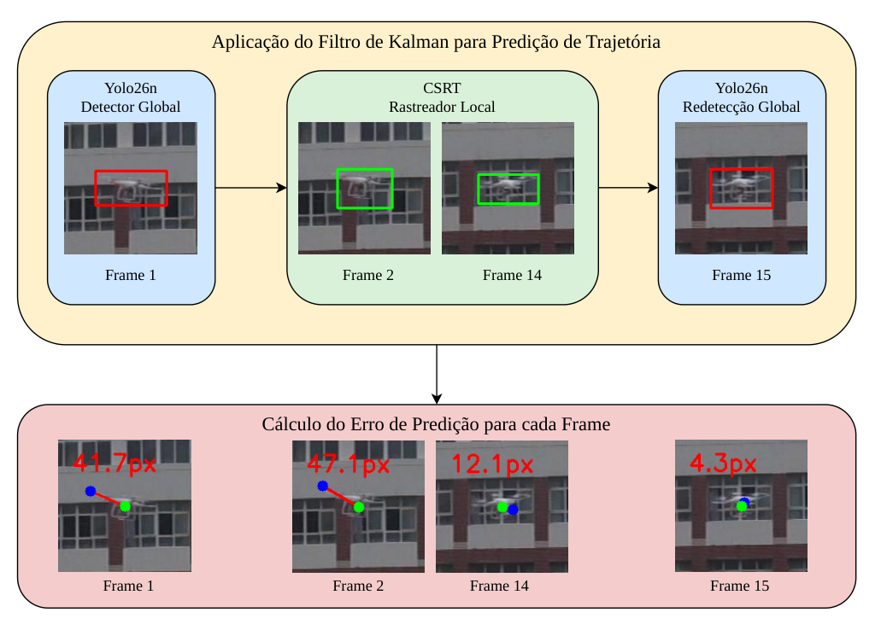

# Arquitetura híbrida para rastreamento e predição de trajetória de VANTs

Código do artigo **"Arquitetura Híbrida para Rastreamento e Predição de Trajetória de VANTs Baseada em Visão Computacional e Filtro de Kalman"**, apresentado no SIGE 2026 (Simpósio de Aplicações Operacionais em Áreas de Defesa, ITA).

Ighor de Souza Ribeiro (CIAA), Rigel Procópio Fernandes (DSAM) e Gabriel de Sapienza Luna (UFRJ).

> **English summary.** Reproducible pipeline for a hybrid single-UAV tracker: a YOLO26n detector re-anchors a CSRT local tracker every 15 frames, and a damped constant-velocity Kalman filter predicts the target position 5, 10, 15 and 30 frames ahead. The scripts download the official DUT Anti-UAV dataset, run the proposed method and the baselines (BoT-SORT, ByteTrack, DeepSORT, and optionally OSTrack/ODTrack), and rebuild every table and figure of the paper from the reader's own runs. Detector weights used in the paper are included. Numbers will differ slightly across machines; method ranking and order of magnitude should hold (see `docs/`).

---

## O método



| Componente | Papel |
|---|---|
| **YOLO26n** (ajuste fino no DUT Anti-UAV) | detecta o drone na inicialização e a cada **N_red = 15** quadros; se a confiança for ≥ 0,7, reancora o rastreador |
| **CSRT** (OpenCV) | acompanha o alvo nos quadros intermediários, na CPU, sem rede neural |
| **Filtro de Kalman de velocidade constante** | estado `[x, y, ẋ, ẏ]`, alimentado pelo centro da caixa; prevê H5, H10, H15 e H30 |
| **Kalman Damped** (γ = 0,95) | multiplica a velocidade por γ a cada passo da predição, reduzindo a extrapolação em horizontes longos |

Todos os parâmetros estão expostos na linha de comando (`--period`, `--init-conf`, `--switch-conf`, `--local-tracker`, `--damping`) para quem quiser fazer ablações.

## Instalação

Python 3.10 ou mais recente. Os resultados do artigo foram produzidos em macOS (Apple M2, MPS); o pipeline também foi testado em Linux (CPU).

```bash
git clone https://github.com/IghorRibeiro/hybrid-uav-tracking-prediction.git
cd hybrid-uav-tracking-prediction
python -m venv .venv && source .venv/bin/activate     # Windows: .venv\Scripts\activate
pip install -r requirements.txt
python check_ambiente.py --recomendado
```

Dois cuidados que resolvem a maior parte dos problemas:

* Instale **somente** o `opencv-contrib-python`. O CSRT, o KCF, o MOSSE e o MedianFlow ficam no pacote *contrib*; se `opencv-python` ou `opencv-python-headless` também estiverem instalados, eles se sobrepõem. O `check_ambiente.py` avisa quando isso acontece.
* O DeepSORT (`deep-sort-realtime`) ainda importa `pkg_resources`, por isso o `requirements.txt` fixa `setuptools<81`.

## Execução rápida

```bash
bash rodar_tudo.sh                                    # baixa o dataset, roda tudo, gera tabelas e figuras
bash rodar_tudo.sh --pular-download --video video03   # com o dataset já baixado: teste rápido em uma sequência
```

O script usa os pesos do artigo (`pesos_treinados/yolo26n_dut_best.pt`), escolhe o dispositivo automaticamente (CUDA, MPS ou CPU) e grava tudo em `results/`. Opções: `--treinar` refaz o ajuste fino do detector, `--com-deepsort` inclui o DeepSORT (lento), `--tabela1` valida os detectores e `--device mps` força o dispositivo.

## Passo a passo

Todos os comandos são executados a partir da raiz do repositório.

| Passo | Comando | Saída |
|---|---|---|
| 1. Dataset oficial | `python src/01_baixar_dataset.py --what tracking` | `datasets/_bruto/` |
| 2. Conversão | `python src/02_converter_dataset.py --only tracking` | `datasets/anti_uav_tracking_test_final/` (20 sequências, 24.804 quadros) |
| 3. Detector (opcional) | `python src/03_treinar_detector.py --model yolo26n.pt` | `pesos_treinados/treinados_localmente/` |
| 4. Rastreamento | `python src/04_rastreadores.py --tracker hibrido` | `results/predictions/hibrido/videoNN.txt` |
| 5. Avaliação | `python src/05_avaliar.py --gt-dir datasets/_bruto --metodos ...` | `results/tabelaN/*.csv` |
| 6. Figuras | `python src/06_figuras.py ...` | `results/figures/*.png\|pdf` |

O [`docs/MAPA_ARTIGO_PIPELINE.md`](docs/MAPA_ARTIGO_PIPELINE.md) liga cada tabela e figura do artigo ao comando exato que a reproduz.

**Dataset.** DUT Anti-UAV (Zhao *et al.*, IEEE T-ITS, 2022), baixado das origens oficiais indicadas em <https://github.com/wangdongdut/DUT-Anti-UAV>. O rastreamento usa só a parte *tracking* (cerca de 3,6 GB compactados); o treino do detector usa também a parte *detection*. Se o Google Drive recusar o download por cota, `python src/01_baixar_dataset.py --manual` lista os links (inclusive o espelho no Baidu) para baixar pelo navegador.

**Baselines.** BoT-SORT, ByteTrack e DeepSORT rodam no passo 4 (`--tracker botsort|bytetrack|deepsort`) com o mesmo YOLO26n. OSTrack e ODTrack dependem dos repositórios e pesos dos autores; `src/extras/rodar_ostrack_odtrack.py` explica a preparação e grava as predições no mesmo formato.

## Métricas

As definições ficam em um único lugar, [`src/uav_common.py`](src/uav_common.py), e valem para todos os métodos:

| Métrica | Definição |
|---|---|
| **SA** | quadros com alvo e IoU ≥ 0,5, somados aos quadros sem alvo corretamente declarados sem alvo, divididos pelo total de quadros |
| **SR@0.5** | fração dos quadros com alvo em que IoU ≥ 0,5 |
| **IoU médio** | média do IoU nos quadros com alvo (quadro sem predição conta como 0) |
| **AUC** | área sob a curva de sucesso, limiares de IoU de 0 a 1 em passos de 0,05 |
| **H5…H30** | distância euclidiana (px) entre o centro previsto H quadros à frente e o centro real |
| **FPS** | quadros por segundo no dispositivo de quem executa |

Todos os métodos são avaliados sobre as mesmas 20 sequências e os mesmos 24.804 quadros. As médias são calculadas por sequência; o IC95% do H30 usa t de Student com n = 20 e os testes pareados (t e Wilcoxon) usam a sequência como unidade amostral. Nas Tabelas 2 e 3, todas as trajetórias passam pelo mesmo Kalman persistente (`--damping 1.0`); o Kalman Damped aparece na Figura 3.

## O que esperar ao reproduzir

O repositório entrega o **método**, não os números do autor: cada execução gera os seus próprios resultados. Versão do Ultralytics, dispositivo (CUDA, MPS ou CPU) e versão do OpenCV mudam algumas detecções limítrofes, e isso se propaga pelo rastreamento. Diferenças de alguns centésimos em SA e SR@0.5 e de alguns pixels no H30 são normais; o que deve se manter é a ordem de grandeza e o comportamento relativo entre os métodos. O FPS mede a sua máquina e só é comparável entre métodos da mesma execução.

* [`docs/DIFERENCAS_ENTRE_AMBIENTES.md`](docs/DIFERENCAS_ENTRE_AMBIENTES.md): o que muda entre máquinas e como relatar.
* [`docs/VALIDACAO.md`](docs/VALIDACAO.md): o avaliador deste repositório, aplicado às predições originais do artigo, reproduz as Tabelas 2 e 3 na precisão publicada.

## Estrutura

```
├── rodar_tudo.sh              pipeline completo
├── check_ambiente.py          diagnóstico do ambiente
├── requirements.txt
├── pesos_treinados/
│   └── yolo26n_dut_best.pt    detector usado no artigo
├── src/
│   ├── uav_common.py          leitura de dados, métricas e Kalman (fonte única)
│   ├── 01_baixar_dataset.py
│   ├── 02_converter_dataset.py
│   ├── 03_treinar_detector.py
│   ├── 04_rastreadores.py     híbrido + baselines
│   ├── 05_avaliar.py          tabelas, IC95%, testes pareados, ablação do damping
│   ├── 06_figuras.py
│   └── extras/rodar_ostrack_odtrack.py
├── tests/test_uav_common.py   testes das métricas e do Kalman (não precisam do dataset)
└── docs/
```

## Citação

```bibtex
@inproceedings{ribeiro2026hibrida,
  title     = {Arquitetura H{\'i}brida para Rastreamento e Predi{\c{c}}{\~a}o de Trajet{\'o}ria de {VANTs}
               Baseada em Vis{\~a}o Computacional e Filtro de Kalman},
  author    = {Ribeiro, Ighor de Souza and Fernandes, Rigel Proc{\'o}pio and Luna, Gabriel de Sapienza},
  booktitle = {Simp{\'o}sio de Aplica{\c{c}}{\~o}es Operacionais em {\'A}reas de Defesa (SIGE)},
  year      = {2026}
}
```

Ao usar o dataset, cite também: J. Zhao, J. Zhang, D. Li e D. Wang, "Vision-based Anti-UAV Detection and Tracking", *IEEE Transactions on Intelligent Transportation Systems*, 2022.

## Licença

Código sob licença [MIT](LICENSE). O pipeline usa o [Ultralytics](https://github.com/ultralytics/ultralytics) (AGPL-3.0), e os pesos em `pesos_treinados/` derivam de um modelo YOLO26 da Ultralytics, portanto seguem os termos da AGPL-3.0. O DUT Anti-UAV é distribuído pelos seus autores sob Apache-2.0.
